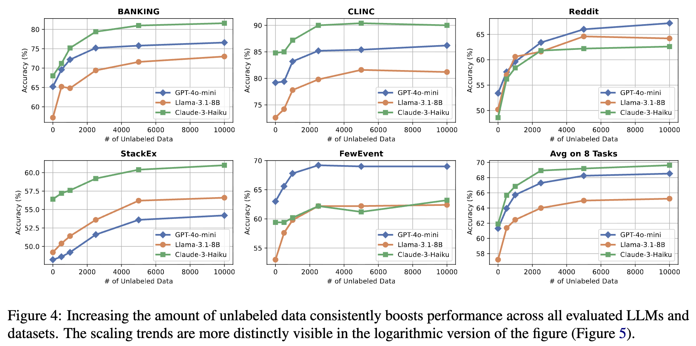

# TestNUC: Enhancing Test-Time Computing Approaches and Scaling through Neighboring Unlabeled Data Consistency


<!--  -->


This repository contains the implementation of the paper:
> **TestNUC: Enhancing Test-Time Computing Approaches and Scaling through Neighboring Unlabeled Data Consistency** 
> [[Paper]](https://aclanthology.org/2025.acl-long.1486.pdf) [[ACL Anthology]](https://aclanthology.org/2025.acl-long.1486/) [[arXiv]](https://arxiv.org/abs/2502.19163) <br>
> The 63rd Annual Meeting of the Association for Computational Linguistics, ACL 2025 <br>
> Henry Peng Zou, Zhengyao Gu, Yue Zhou, Yankai Chen, Weizhi Zhang, Liancheng Fang, Yibo Wang, Yangning Li, Kay Liu, Philip S. Yu <br>


## Overview

TL;DR: Simple Test-Time Scaling with Unlabeled Data

Test-time computing approaches, which leverage additional computational resources during inference, have been proven effective in enhancing large language model performance. This work introduces a novel, linearly scaling approach, TestNUC, that improves test-time predictions by leveraging the local consistency of neighboring unlabeled data-it classifies an input instance by considering not only the model's prediction on that instance but also on neighboring unlabeled instances. TestNUC scales effectively with increasing amounts of unlabeled data and performs robustly across different embedding models, making it practical for real-world applications.




## Installation
To get started, create a new environment and install dependancy:

```bash
conda create -n testnuc python=3.10 -y
conda activate testnuc
pip install -r requirements.txt
```


## Quick Start

Simply run the [aggregation_num_unlabeled_data.ipynb](https://github.com/HenryPengZou/TestNUC/blob/main/scripts_gpt4omini/aggregation_num_unlabeled_data.ipynb) notebook to reproduce and visualize test-time scaling results with varying amounts of unlabeled data. 

## Tutorial

### 1. Obtain Embeddings

You can download pre-extracted embeddings from this [Google Drive Folder](https://drive.google.com/drive/folders/1Y6QhJW9nb3objSHQue0rA3pmT4cvcg2f):

```bash
gdown --folder https://drive.google.com/drive/folders/1Y6QhJW9nb3objSHQue0rA3pmT4cvcg2f -O ./data/
```

You can also choose to extract embeddings by yourself from any embedder on [Huggingface Embedder Leaderboard](https://huggingface.co/spaces/mteb/leaderboard) by following their insturction, e.g., [Qwen Embedder Usage](https://huggingface.co/Qwen/Qwen3-Embedding-8B#usage).


### 2. Pseudo Labeling / Obtain Initial LLM Predictions

Extract inital LLM predictions by running `pseudo_labeling.ipynb` in `scripts_llm` folder -> [example_file_link](https://github.com/HenryPengZou/TestNUC/blob/main/scripts_gpt4omini/pseudo_labeling.ipynb).


### 3. Neibhor Retrieval & Collaborative Prediction

Simply run `aggregation_num_unlabeled_data.ipynb` in `scripts_llm` folder -> [example_file_link](https://github.com/HenryPengZou/TestNUC/blob/main/scripts_gpt4omini/aggregation_num_unlabeled_data.ipynb).


## Bugs or Questions

If you have any questions related to the code or the paper, feel free to email Henry Peng Zou (pzou3@uic.edu). If you encounter any problems when using the code, or want to report a bug, you can open an issue. Please try to specify the problem with details so we can help you better and quicker!


## Citation

If you find this repository helpful, please consider citing our paper 💕: 
```bibtex
@misc{zou2025testnucenhancingtesttimecomputing,
      title={TestNUC: Enhancing Test-Time Computing Approaches and Scaling through Neighboring Unlabeled Data Consistency}, 
      author={Henry Peng Zou and Zhengyao Gu and Yue Zhou and Yankai Chen and Weizhi Zhang and Liancheng Fang and Yibo Wang and Yangning Li and Kay Liu and Philip S. Yu},
      year={2025},
      eprint={2502.19163},
      archivePrefix={arXiv},
      primaryClass={cs.CL},
      url={https://arxiv.org/abs/2502.19163}, 
}
```

